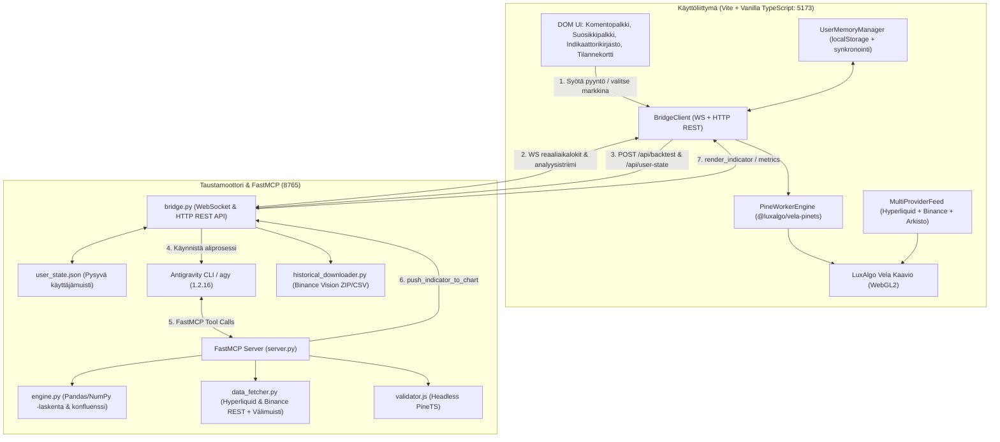

# Vela Agent Workbench

[](LICENSE)
[](https://github.com/LuxAlgo/Vela)
[](https://github.com/jlowin/fastmcp)
[](https://github.com/LuxAlgo/PineTS)
[](#datalähteet)

**Vela Agent Workbench** on paikallisesti ajettava ja Tailnetin (MagicDNS) kautta suojatusti saavutettava kvantitatiivinen analyysi- ja kaavioympäristö. Järjestelmä yhdistää reaaliaikaisen WebGL2-markkinakaavion, dynaamisen Pine Script v5 / PineTS -suorituksen, deterministisen Python-backtestauksen, useiden indikaattoreiden konfluenssianalyysin sekä tekoälyagentin (Antigravity 2.0 / CLI) orkestroinnin.

---

## Arkkitehtuuri



---

## Keskeiset Ominaisuudet

1. **Vela WebGL2 -kaavio**: Viiveetön, 60+ FPS kynttilä- ja indikaattorirenderöinti suoralla GPU-kiihdytyksellä.
2. **Kaksi Datalähdettä & Arkistot (MultiProviderFeed)**:
   - **Hyperliquid**: Suora WebSocket-virta ja REST-historiadata (234 ikifutuuria).
   - **Binance**: Globaali `api.binance.com` ja `data-api.binance.vision` REST-kynttilädata (503 spottiparia).
   - **Binance Vision CSV -arkistot**: Paikallisesti ladattu syvä historiadata vuodesta 2017 alkaen.
3. **Tokeniparien Haku & ⭐ Suosikit**:
   - Yläpalkin `🔍 BTC/USD HL ▼` -hakumodaali yli 730 tokenille reaaliaikaisella suodatuksella.
   - Tähtikuvakkeella merkityt suosikit näkyvät suosikkipalkissa välitöntä markkinanvaihtoa varten.
4. **Indikaattorikirjasto (📊 Indikaattorit)**:
   - **Omat indikaattorit**: Tallennus levylle ja hallinta.
   - **TradingView Community Scripts (10 kpl)**: Valmiit testatut suosikkiskriptit (*Supertrend*, *Waddah Attar Explosion*, *Volume Flow*, *Nadaraya-Watson* jne.).
   - **Tekoälygeneraattori**: Prompt -> Pine Script v5 -koodaus, syntaksin tarkistus ja kaaviolle injektio.
   - **Manuaalinen koodieditori**: Liitä omaa Pine Script v5 -koodia ja testaa kaaviolla.
5. **💬 Kysy Kuvaajasta (Tekninen Tekoälyanalyysi)**:
   - Oikeassa sivupaneelissa täysin dedikoitu tilannekatsauskortti:
     - Reaaliaikainen suuntamerkki: 🟢 OSTO / 🔴 MYYNTI / 🟡 NEUTRAALI.
     - Pikanapit: *Osto vai myynti?*, *Tuki- ja vastustasot*, *Signaalien konfluenssi*, *Trendi & RSI*, *ATR & Stop-loss*, *Volyymipoikkeamat*.
     - Chat-kenttä tunnistaa luonnollisen kielen aikeet ja reitittää backtest-pyynnöt automaattisesti laskentamoottorille.
6. **Kvantitatiivinen Backtestaus & Moni-indikaattorikonfluenssi (`▶️ Aja Backtest`)**:
   - Luotettava suoritus suoran `POST /api/backtest` HTTP REST -väylän kautta (< 200 ms).
   - **Dynaaminen signaalitulkinta**: Tunnistaa koodista ja nimistä automaattisesti liukuvat keskiarvot (`EMA 20/50`), `RSI`:n, `Supertrendin` ja `Donchian Breakoutin`.
   - **Monen indikaattorin yhdistelmä**: Kun kaaviolle ladataan useita indikaattoreita päällekkäin, järjestelmä yhdistää ne yhdeksi konfluenssistrategiaksi (trendi + momentum + volatiliteettisuodatus).
   - **Long & Short -simulaatio**: Testaa 500 kynttilälle sekä osto- että myyntipositiot.
   - **Metriikat**: Voittoprosentti, Profit Factor, Suurin pudotus (Max Drawdown), Kauppojen määrä, Kesk. tuotto ja Kokonaistuotto.
7. **Yhden Käyttäjän Pysyvä Muisti (`UserMemory`)**:
   - Kaksoistallennus selaimen `localStorageen` ja palvelimen `backend/user_state.json` -tiedostoon.
   - Muistaa automaattisesti sivun päivityksen (F5) yli:
     - Valitun markkinaparin, aikajänteen ja pörssin.
     - Suosikkiparit (⭐).
     - **Kaikki kaaviolle ladatut indikaattorit** (injektoidaan takaisin käynnistyksessä).
     - Viimeisimmät backtest-metriikat ja tilannekatsaukset.
8. **Täysi Historiadata & Arkistokatselin (💾 Historiadata)**:
   - Lataa ja purkaa `data.binance.vision` -kuukausiarkistoja ZIP/CSV-muodossa.
   - **📊 Avaa kaaviolla**: Avaa ladatut CSV-tiedostot suoraan Vela WebGL2 -kaaviolle tarkasteltavaksi.
9. **Headless Syntaksivalidointi**:
   - `validator.js` testaa koodin Node.js / PineTS -kääntäjällä ennen kaaviolle viemistä.
10. **Puhdas Tailnet / MagicDNS -yhteensopivuus**:
    - Kaikki palvelut bindautuvat `0.0.0.0` -osoitteeseen ja tunnistavat isäntäkoneen automaattisesti. Toimii puhelimella ja tabletilla suoraan Tailscale-yhteyden yli ilman julkisia portteja.

---

## Hakemistorakenne

```
VELA-AGENT-WORKBENCH/
├── backend/
│   ├── server.py              # FastMCP-palvelin (4 kvanttityökalua Antigravitylle)
│   ├── bridge.py              # WebSocket & HTTP -silta selaimen ja CLI:n välillä (portti 8765)
│   ├── engine.py              # Deterministinen Pandas/NumPy-analyysi ja monikonfluenssi-backtest
│   ├── data_fetcher.py        # Hyperliquid & Binance REST -historiadata ja levymuisti
│   ├── historical_downloader.py # Binance Vision ZIP/CSV -lataaja ja arkistokatselin
│   ├── validator.js           # Headless Node/PineTS -syntaksitarkistin
│   ├── user_state.json        # Yhden käyttäjän pysyvä tilamuisti
│   ├── indicators/            # Käyttäjän tallentamat Pine Script -indikaattorit
│   ├── mcp_config.json        # FastMCP-asetustiedosto Antigravity CLI:lle
│   └── requirements.txt       # Python-riippuvuudet (fastmcp, aiohttp, pandas jne.)
│
├── frontend/
│   ├── index.html             # DOM-ohjattu käyttöliittymä ja modaalit
│   ├── package.json           # @luxalgo/vela, @luxalgo/vela-pinets, pinets, vite
│   ├── tsconfig.json
│   ├── vite.config.ts         # Vite-konfiguraatio (host: 0.0.0.0, port: 5173)
│   └── src/
│       ├── main.ts            # Pääsovellus, tapahtumakuuntelijat, tilanpalautus ja reititys
│       ├── chart.ts           # Vela WebGL2 -alustus, MultiProviderFeed ja indikaattorien hallinta
│       ├── bridge_client.ts   # WS- ja HTTP REST -asiakas taustasillalle (portti 8765)
│       ├── user_memory.ts     # Yhden käyttäjän muistijärjestelmä (localStorage + /api/user-state)
│       ├── community_scripts.ts # 10 valmista TradingView Community Scriptiä
│       └── hyperliquid.ts     # Hyperliquid WS & REST -asiakas
│
├── config/
│   └── system_prompt.txt      # Antigravity CLI:n kvanttianalyytikon järjestelmäkehote
├── docs/
│   ├── architecture.md        # Yksityiskohtainen järjestelmäarkkitehtuuri ja tietovirrat
│   ├── api_reference.md       # FastMCP-, REST- ja WebSocket-rajapintadokumentaatio
│   ├── user_guide.md          # Käyttöohje ja Tailnet-mobiiliohjaus
│   └── prompt_templates.md    # Kehotepohjat ja orkestrointisäännöt
├── tests/
│   └── test_backend.py        # Yksikkötestit
├── run.bat                    # Windows Batch -käynnistin
├── run.ps1                    # PowerShell-käynnistin
├── run.sh                     # Linux / macOS Bash -käynnistin
└── setup_linux.sh             # Linuxin automatisoitu asennusskripti
```

---

## Pika-aloitus

### 1. Esivaatimukset
- **Python**: >= 3.10
- **Node.js**: >= 20.x
- **Antigravity CLI** (`agy`): v1.2.16 tai uudempi (valinnainen täyteen AI-tilaan)

### 2. Riippuvuuksien asennus

```bash
# 1. Asenna Python-riippuvuudet
python -m pip install -r backend/requirements.txt

# 2. Asenna Frontend-riippuvuudet
npm --prefix frontend install
```

### 3. FastMCP-työkalujen rekisteröinti (Antigravity CLI)

Jos käytät Antigravity CLI:tä (`agy`):
```powershell
agy mcp add vela_quant python "$PWD\backend\server.py"
```

Varmista rekisteröinti:
```powershell
agy mcp list
```

### 4. Käynnistys

Voit käynnistää sekä taustasillan että selainkäyttöliittymän yhdellä komennolla käyttöjärjestelmästäsi riippuen:

**Linuxissa & macOS:ssa:**
```bash
# Ensimmäisellä kerralla voit asentaa kaiken suoraan:
chmod +x setup_linux.sh run.sh
./setup_linux.sh

# Käynnistä järjestelmä:
./run.sh
```

**Windows PowerShellissä:**
```powershell
.\run.ps1
```

**Tai Windows komentokehotteessa:**
```cmd
run.bat
```

Avaa selaimessa:
- **Lokaalisti**: `http://localhost:5173`
- **Tailnetin / MagicDNS:n kautta**: `http://<oma-laitenimi>:5173` (toimii suoraan puhelimella tai tabletilla)

---

## Rajapinnat ja Työkalut

### FastMCP-työkalut (`backend/server.py`)

| Työkalu | Kuvaus | Parametrit |
| :--- | :--- | :--- |
| `get_market_context` | Hakee OHLCV-tilastot, ATR-volatiliteetin, trendin ja volyymin. | `symbol`, `timeframe`, `candles`, `source` |
| `validate_pinets_syntax` | Validoi Pine Script v5 / PineTS -syntaksin headless-prosessissa. | `script_code` |
| `run_quantitative_backtest` | Suorittaa tilastollisen backtestin 500 kynttilälle historiadataan. | `symbol`, `timeframe`, `strategy_rules`, `source` |
| `push_indicator_to_chart` | Injektoi testatun indikaattorin suoraan aktiiviseen Vela-kaavioon. | `script_code`, `indicator_name` |

### Keskeiset HTTP REST -rajapinnat (`backend/bridge.py` : 8765)

| Reitti | Metodi | Kuvaus |
| :--- | :--- | :--- |
| `/api/backtest` | `POST` | Välitön, luotettava kvantitatiivinen backtest (yksittäinen tai moni-indikaattorikonfluenssi). |
| `/api/user-state` | `GET` / `POST` | Yhden käyttäjän pysyvä tilamuisti (markkina, suosikit, aktiiviset indikaattorit, tulokset). |
| `/api/symbols` | `GET` | Kaikki saatavilla olevat kaupankäyntiparit (Hyperliquid + Binance). |
| `/api/candles` | `GET` | OHLCV-kynttilähistoria live-pörsseistä tai ladatusta arkistosta. |
| `/api/indicators` | `GET` / `POST` / `DELETE` | Käyttäjän tallentamat indikaattorit levyltä. |
| `/api/historical/download` | `POST` | Lataa ja purkaa `data.binance.vision` ZIP/CSV-kuukausipaketit. |
| `/api/historical/list` | `GET` | Listaa kaikki levylle ladatut arkistot. |

Yksityiskohtainen rajapintakuvaus löytyy tiedostosta [docs/api_reference.md](docs/api_reference.md).

---

## Testien suoritus

Aja taustamoottorin yksikkötestit:
```powershell
python -m unittest tests/test_backend.py
```

Testaa headless syntaksitarkistin:
```powershell
node backend/validator.js "//@version=5`nindicator('Test')`nplot(close)"
```

Testaa frontendin tuotantokäännös:
```powershell
npm --prefix frontend run build
```

---

## Dokumentaatio

- [Arkkitehtuuri ja järjestelmäkuvaus](docs/architecture.md)
- [API- ja FastMCP-rajapintareferenssi](docs/api_reference.md)
- [Käyttöohje ja Tailnet-opas](docs/user_guide.md)
- [Kehotepohjat ja säännöt](docs/prompt_templates.md)

---

## Lisenssi

MIT License. Katso [LICENSE](LICENSE) lisätietoja varten.
