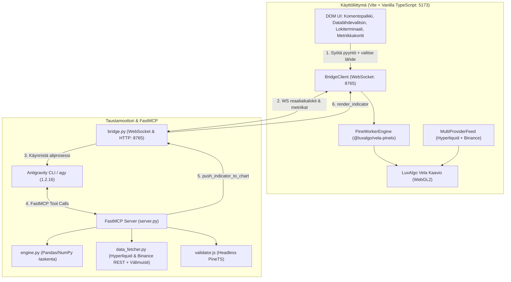

# Vela Agent Workbench

[](LICENSE)
[](https://github.com/LuxAlgo/Vela)
[](https://github.com/jlowin/fastmcp)
[](https://github.com/LuxAlgo/PineTS)
[](#datalähteet)

**Vela Agent Workbench** on paikallisesti ajettava ja Tailnetin (MagicDNS) kautta suojatusti saavutettava kvantitatiivinen analyysi- ja kaavioympäristö. Järjestelmä yhdistää reaaliaikaisen WebGL2-markkinakaavion, dynaamisen Pine Script v5 / PineTS -suorituksen, deterministisen Python-backtestauksen sekä tekoälyagentin (Antigravity 2.0 / CLI) orkestroinnin.

---

## Arkkitehtuuri



---

## Keskeiset Ominaisuudet

1. **Vela WebGL2 -kaavio**: Viiveetön, 60+ FPS kynttilä- ja indikaattorirenderöinti suoralla GPU-kiihdytyksellä.
2. **Kaksi Datalähdettä (MultiProviderFeed)**:
   - **Hyperliquid**: Suora WebSocket-virta ja REST-historiadata.
   - **Binance**: Globaali `api.binance.com` ja `data-api.binance.vision` REST-kynttilädata.
   - Vaihto lennosta käyttöliittymän pudotusvalikosta.
3. **Pine Script v5 / PineTS Selaimessa**: `@luxalgo/vela-pinets` suorittaa indikaattorit taustasäikeessä (Web Worker) kuormittamatta käyttöliittymää.
4. **Kaksi Suoritustilaa**:
   - **Antigravity AI (Täysi orkestrointi)**: Antigravity CLI ajaa monivaiheisen korjaussilmukan (konteksti -> koodaus -> syntaksivalidointi -> korjaus -> backtestaus -> kaaviolle vienti).
   - **Pika-analyysi (Välitön < 500ms)**: Paikallinen analyysimoottori laskee tilastot, generoi koodin, ajaa 500 kynttilän backtestauksen ja injektoi indikaattorin ilman LLM-viivettä.
5. **Deterministinen Laskentamoottori**: ATR(14), liukuvat keskiarvot, trendin suunta ja voimakkuus, signaalisimulaatiot, voittoprosentti, drawdown ja profit factor lasketaan puhtaasti historiadataan ilman kielimallin harhoja.
6. **Headless Syntaksivalidointi**: Koodi testataan taustalla ennen kaaviolle viemistä.
7. **Puhdas Tailnet / MagicDNS -yhteensopivuus**: Bindaus `0.0.0.0` ja dynaaminen isäntäosoitteen tunnistus takaavat toimivuuden lähiverkossa ja kännykällä Tailscale-yhteyden yli ilman julkisia portteja.

---

## Hakemistorakenne

```
VELA-AGENT-WORKBENCH/
├── backend/
│   ├── server.py              # FastMCP-palvelin (4 kvanttityökalua Antigravitylle)
│   ├── bridge.py              # WebSocket & HTTP -silta selaimen ja CLI:n välillä
│   ├── engine.py              # Deterministinen Pandas/NumPy-analyysi ja backtest
│   ├── data_fetcher.py        # Hyperliquid & Binance REST -historiadata ja levymuisti
│   ├── validator.js           # Headless Node/PineTS -syntaksitarkistin
│   ├── mcp_config.json        # FastMCP-asetustiedosto Antigravity CLI:lle
│   └── requirements.txt       # Python-riippuvuudet (fastmcp, aiohttp, pandas jne.)
│
├── frontend/
│   ├── index.html             # Kevyt DOM-ohjattu käyttöliittymä
│   ├── package.json           # @luxalgo/vela, @luxalgo/vela-pinets, pinets, vite
│   ├── tsconfig.json
│   ├── vite.config.ts         # Vite-konfiguraatio (host: 0.0.0.0, port: 5173)
│   └── src/
│       ├── main.ts            # DOM-tapahtumakuuntelijat ja pörssivalitsimen ohjaus
│       ├── chart.ts           # Vela-alustus (MultiProviderFeed) ja indikaattorien injektio
│       ├── hyperliquid.ts     # Hyperliquid WS & REST -asiakas
│       └── bridge_client.ts   # WS-asiakas taustasillalle (portti 8765)
│
├── config/
│   └── system_prompt.txt      # Antigravity CLI:n kvanttianalyytikon järjestelmäkehote
├── docs/
│   ├── architecture.md        # Yksityiskohtainen järjestelmäarkkitehtuuri ja tietovirrat
│   ├── api_reference.md       # FastMCP-, REST- ja WebSocket-rajapintadokumentaatio
│   ├── user_guide.md          # Käyttöohje ja Tailnet-mobiiliohjaus
│   └── prompt_templates.md    # Kehotepohjat ja orkestrointisäännöt
├── tests/
│   └── test_backend.py        # Yksikkötestit
├── run.bat                    # Windows Batch -käynnistin
└── run.ps1                    # PowerShell-käynnistin
```

---

## Pika-aloitus

### 1. Esivaatimukset
- **Python**: >= 3.10
- **Node.js**: >= 20.x
- **Antigravity CLI** (`agy`): v1.2.16 tai uudempi (valinnainen täyteen AI-tilaan)

### 2. Riippuvuuksien asennus

```bash
# 1. Asenna Python-riippuvuudet
python -m pip install -r backend/requirements.txt

# 2. Asenna Frontend-riippuvuudet
npm --prefix frontend install
```

### 3. FastMCP-työkalujen rekisteröinti (Antigravity CLI)

Jos käytät Antigravity CLI:tä (`agy`):
```powershell
agy mcp add vela_quant python "$PWD\backend\server.py"
```

Varmista rekisteröinti:
```powershell
agy mcp list
```

### 4. Käynnistys

Voit käynnistää sekä taustasillan että selainkäyttöliittymän yhdellä komennolla:

**PowerShellissä:**
```powershell
.\run.ps1
```

**Tai Windows komentokehotteessa:**
```cmd
run.bat
```

Avaa selaimessa:
- **Lokaalisti**: `http://localhost:5173`
- **Tailnetin / MagicDNS:n kautta**: `http://<oma-laitenimi>:5173` (toimii suoraan puhelimella tai tabletilla)

---

## FastMCP-työkalut

Antigravity CLI:lle ja tekoälyorkestroijalle on määritelty neljä determinististä työkalua:

| Työkalu | Kuvaus | Parametrit |
| :--- | :--- | :--- |
| `get_market_context` | Hakee OHLCV-tilastot, ATR-volatiliteetin, trendin ja volyymin. | `symbol`, `timeframe`, `candles`, `source` |
| `validate_pinets_syntax` | Validoi Pine Script v5 / PineTS -syntaksin headless-prosessissa. | `script_code` |
| `run_quantitative_backtest` | Suorittaa tilastollisen backtestin 500 kynttilälle historiadataan. | `symbol`, `timeframe`, `strategy_rules`, `source` |
| `push_indicator_to_chart` | Injektoi testatun indikaattorin suoraan aktiiviseen Vela-kaavioon. | `script_code`, `indicator_name` |

Yksityiskohtainen rajapintakuvaus löytyy tiedostosta [docs/api_reference.md](docs/api_reference.md).

---

## Testien suoritus

Aja taustamoottorin yksikkötestit:
```powershell
python -m unittest tests/test_backend.py
```

Testaa headless syntaksitarkistin:
```powershell
node backend/validator.js "//@version=5`nindicator('Test')`nplot(close)"
```

Testaa frontendin tuotantokäännös:
```powershell
npm --prefix frontend run build
```

---

## Dokumentaatio

- [Arkkitehtuuri ja järjestelmäkuvaus](docs/architecture.md)
- [API- ja FastMCP-rajapintareferenssi](docs/api_reference.md)
- [Käyttöohje ja Tailnet-opas](docs/user_guide.md)
- [Kehotepohjat ja säännöt](docs/prompt_templates.md)

---

## Lisenssi

MIT License. Katso [LICENSE](LICENSE) lisätietoja varten.
