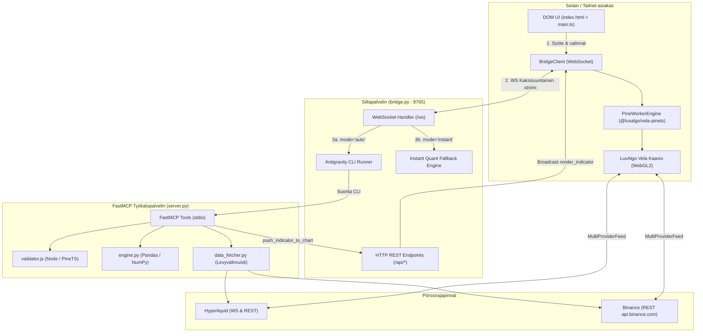
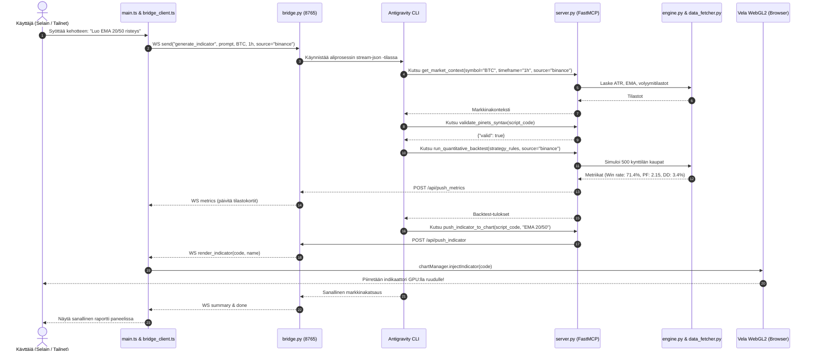

# Vela Agent Workbench – Järjestelmäarkkitehtuuri

Tämä dokumentti kuvaa **Vela Agent Workbenchin** teknisen arkkitehtuurin, komponenttien vastuualueet, suoritusympäristön ja tietovirrat.

---

## 1. Arkkitehtoniset Perusperiaatteet

1. **Reaaliaikaisuus ja GPU-suorituskyky**: Kaavion piirrossa hyödynnetään WebGL2-tekniikkaa (`@luxalgo/vela`). Kaikki indikaattorilogiikat ajetaan erillisessä Web Workerissa (`@luxalgo/vela-pinets`), jolloin pääsäie ja käyttöliittymä pysyvät täysin vasteellisina 60+ FPS nopeudella.
2. **Kevyt ja Deterministinen Frontend**: Käyttöliittymä on toteutettu puhtaalla Vanilla TypeScriptillä ilman raskaita SPA-kehyksiä (kuten React tai Vue). DOM-päivitykset tehdään suorilla funktiokutsuilla.
3. **Numeerinen Objektiivisuus**: Kaikki matemaattiset metriikat (ATR, liukuvat keskiarvot, voittoprosentit, drawdown, profit factor) lasketaan deterministisesti Pythonissa (`pandas`/`numpy`). Kielimallia ei käytetä laskentaan, jolloin vältetään hallusinaatiot.
4. **FastMCP & Autonominen Korjaussilmukka**: Tekoälymalli toimii orkestroijana FastMCP-työkalujen avulla: se hakee faktapohjaisen tilanteen, kääntää idean Pine Script v5 -koodiksi, validoi syntaksin headless-kääntäjällä ja korjaa mahdolliset virheet ennen koodin viemistä kaaviolle.
5. **Puhdas Tailnet-tietoturva**: Palvelin ja selain bindautuvat kaikkiin osoitteisiin (`0.0.0.0`), ja liikenne pysyy täysin salattuna laitteiden välillä Tailscale-verkon (MagicDNS) kautta ilman julkisia portteja tai ulkoisia välityspalvelimia.

---

## 2. Järjestelmäarkkitehtuuri ja Komponentit



---

## 3. Komponenttikohtainen Erottelu

### 3.1 Frontend (`frontend/`)

- **[`index.html`](file:///c:/Users/user/Documents/koodit/VELA-AGENT-WORKBENCH/frontend/index.html)**:
  - Yläpalkki: Pörssin datalähteen valitsin (`Hyperliquid` / `Binance`), markkinapari (`BTC`, `ETH`, `SOL`, `DOGE`), aikajänne (`1m` - `1d`), mallivalitsin ja suoritustila (`auto` / `instant`).
  - Kaavioalue: WebGL2-canvas, johon Vela liitetään.
  - Oikea sivupaneeli: Luonnollisen kielen komentopalkki, pikavalintanapit, suoratoistoterminaali, metriikkakortit ja agentin sanallinen tilannekatsaus.
- **[`src/chart.ts`](file:///c:/Users/user/Documents/koodit/VELA-AGENT-WORKBENCH/frontend/src/chart.ts)**:
  - Hallinnoi Vela-instanssia `MultiProviderFeed`-syötteellä.
  - Rekisteröi sekä `HyperliquidProvider` että `BinanceProvider`.
  - Alustaa `@luxalgo/vela-pinets` -moottorin (`PineWorkerEngine` ensisijaisesti, `PineEngine` varalla).
  - Tarjoaa metodit:
    - `init(symbol, timeframe, source)`
    - `setMarket(symbol, timeframe, source)`
    - `injectIndicator(code, name)`
- **[`src/bridge_client.ts`](file:///c:/Users/user/Documents/koodit/VELA-AGENT-WORKBENCH/frontend/src/bridge_client.ts)**:
  - Muodostaa WebSocket-yhteyden dynaamisesti isännän mukaan (`ws://${window.location.hostname}:8765/ws`).
  - Reagoi automaattisesti yhteyskatkoihin ja kytkeytyy uudelleen.
  - Jakaa saapuvat viestit tyypeittäin (`log`, `metrics`, `render_indicator`, `summary`, `done`, `error`).
- **[`src/main.ts`](file:///c:/Users/user/Documents/koodit/VELA-AGENT-WORKBENCH/frontend/src/main.ts)**:
  - Liittää DOM-tapahtumat `VelaChartManager`- ja `BridgeClient`-luokkiin.

---

### 3.2 Taustasilta ja Prosessinhallinta (`backend/bridge.py`)

- **WebSocket-palvelin (`0.0.0.0:8765`)**:
  - Kuuntelee selaimelta tulevia `generate_indicator`-viestejä.
  - Suoratoistaa agentin stdout/stderr-viestit rivi riviltä selaimen terminaaliin.
  - Lähettää valmistuneet indikaattorikoodit ja backtest-metriikat selaimeen.
- **HTTP REST -päätepisteet**:
  - `POST /api/push_indicator`: Vastaanottaa indikaattorin FastMCP-työkalulta ja lähettää sen WebSocket-asiakkaille.
  - `POST /api/push_metrics`: Vastaanottaa lasketut backtest-metriikat.
  - `GET /api/candles`: Palauttaa JSON-kynttilähistorian katselua tai testausta varten.
  - `GET /api/health`: Terveystarkistus.
- **Antigravity CLI -aliprosessi**:
  - Käynnistää `agy.exe` komennolla:
    ```bash
    agy --dangerously-skip-permissions --output-format stream-json --effort high --model <malli> -p "<kehote>"
    ```
  - Lukee `stream-json`-formaattia ja erottelee työkalukutsut, lokit ja lopputuloksen.
- **Pika-analyysimoottori (`run_fallback_agent`)**:
  - Jos tila on `instant` tai CLI ei ole saatavilla, ajaa deterministisen analyysin välittömästi alle 500 millisekunnissa.

---

### 3.3 FastMCP & Kvanttilaskenta (`backend/server.py`, `engine.py`, `data_fetcher.py`)

- **[`backend/server.py`](file:///c:/Users/user/Documents/koodit/VELA-AGENT-WORKBENCH/backend/server.py)**:
  - FastMCP-palvelin, joka tarjoaa työkalut Antigravitylle standardin MCP-protokollan yli.
- **[`backend/data_fetcher.py`](file:///c:/Users/user/Documents/koodit/VELA-AGENT-WORKBENCH/backend/data_fetcher.py)**:
  - Noutaa historiakynttilät:
    - **Hyperliquid**: `https://api.hyperliquid.xyz/info`
    - **Binance**: `https://api.binance.com/api/v3/klines` ja `https://data-api.binance.vision/api/v3/klines`
  - Paikallinen levymuisti polussa `backend/.cache/` estää turhat rajapintapyynnöt ja takaa offline-testattavuuden.
- **[`backend/engine.py`](file:///c:/Users/user/Documents/koodit/VELA-AGENT-WORKBENCH/backend/engine.py)**:
  - Numeerinen tilastolaskenta:
    - ATR(14) absoluuttisena ja prosentuaalisena volatiliteettina.
    - EMA(20), EMA(50), SMA(100) trendianalyysiin.
    - RSI(14) yliostettu/ylimyyty-tiloihin.
    - Volyymisuhde suhteessa 20 kynttilän keskiarvoon.
  - Deterministinen backtest-moottori:
    - Simuloi kauppasignaalit (crossover, RSI, breakout, jne.).
    - Laskee voittoprosentin, kokonaistuoton, keskimääräisen tuoton, drawdownin ja profit factorin.
- **[`backend/validator.js`](file:///c:/Users/user/Documents/koodit/VELA-AGENT-WORKBENCH/backend/validator.js)**:
  - Ajaa headless Node.js -prosessissa `@luxalgo/pinets` -kääntäjän.
  - Tarkistaa Pine Script v5 -syntaksin ja palauttaa virheen sattuessa tarkan rivinumeron ja kuvauksen.

---

## 4. Työnkulkusekvenssi (Täysi Orkestrointi)



---

## 5. Verkko- ja Tietoturvamalli (Tailnet)

- **Ei julkisia reitityksiä**: Palvelin ei vaadi julkista IP-osoitetta, porttiohjauksia eikä ulkoisia välityspalvelimia.
- **Tailscale MagicDNS**: Kaikki laitteet tunnistavat toisensa suojatussa WireGuard-pohjaisessa Tailnet-verkossa.
- **Dynaaminen isäntäpäätelmä**: Selaimen koodi päättelee WebSocket-osoitteen `window.location.hostname` -muuttujan avulla. Näin ollen sama osoite toimii suoraan kannettavalla, puhelimella tai pöytäkoneella.
