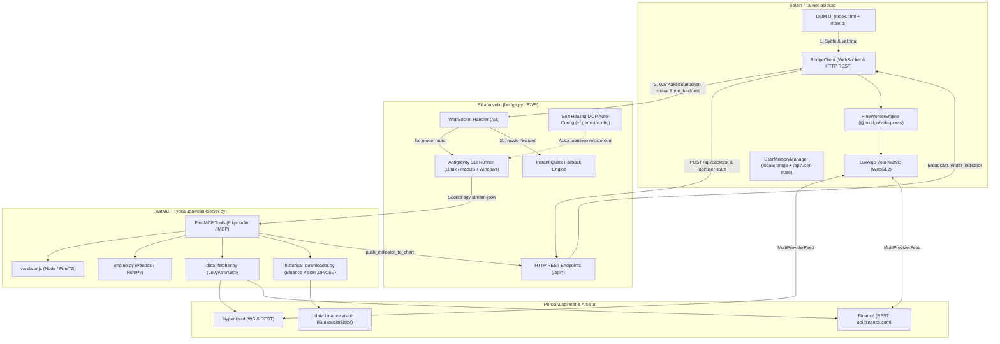
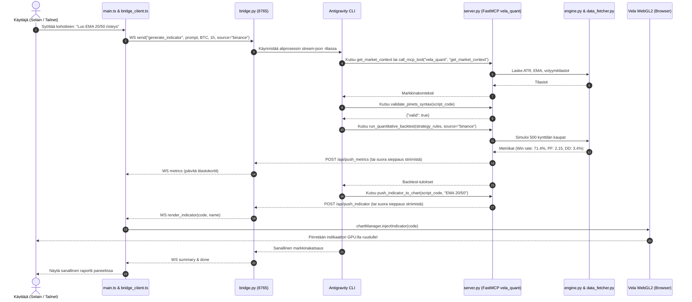

# Vela Agent Workbench – Järjestelmäarkkitehtuuri

Tämä dokumentti kuvaa **Vela Agent Workbenchin** teknisen arkkitehtuurin, komponenttien vastuualueet, suoritusympäristön ja tietovirrat.

---

## 1. Arkkitehtoniset Perusperiaatteet

1. **Reaaliaikaisuus ja GPU-suorituskyky**: Kaavion piirrossa hyödynnetään WebGL2-tekniikkaa (`@luxalgo/vela`). Kaikki indikaattorilogiikat ajetaan erillisessä Web Workerissa (`@luxalgo/vela-pinets`), jolloin pääsäie ja käyttöliittymä pysyvät täysin vasteellisina 60+ FPS nopeudella.
2. **Kevyt ja Deterministinen Frontend**: Käyttöliittymä on toteutettu puhtaalla Vanilla TypeScriptillä ilman raskaita SPA-kehyksiä (kuten React tai Vue). DOM-päivitykset tehdään suorilla funktiokutsuilla.
3. **Numeerinen Objektiivisuus**: Kaikki matemaattiset metriikat (ATR, liukuvat keskiarvot, voittoprosentit, drawdown, profit factor) lasketaan deterministisesti Pythonissa (`pandas`/`numpy`). Kielimallia ei käytetä laskentaan, jolloin vältetään hallusinaatiot.
4. **FastMCP & Autonominen Korjaussilmukka**: Tekoälymalli toimii orkestroijana FastMCP-työkalujen avulla: se hakee faktapohjaisen tilanteen, kääntää idean Pine Script v5 -koodiksi, validoi syntaksin headless-kääntäjällä ja korjaa mahdolliset virheet ennen koodin viemistä kaaviolle.
5. **Puhdas Tailnet-tietoturva**: Palvelin ja selain bindautuvat kaikkiin osoitteisiin (`0.0.0.0`), ja liikenne pysyy täysin salattuna laitteiden välillä Tailscale-verkon (MagicDNS) kautta ilman julkisia portteja tai ulkoisia välityspalvelimia.

---

## 2. Järjestelmäarkkitehtuuri ja Komponentit



---

## 3. Komponenttikohtainen Erottelu

### 3.1 Frontend (`frontend/`)

- **[`frontend/index.html`](../frontend/index.html)**:
  - Yläpalkki: Pörssin datalähteen valitsin (`Hyperliquid` / `Binance` / `Arkisto`), markkinapari (`BTC`, `ETH`, `SOL`, `DOGE`...), aikajänne (`1m` - `1M`), mallivalitsin ja suoritustila (`auto` / `instant`).
  - Kaavioalue: WebGL2-canvas, johon Vela liitetään.
  - Oikea sivupaneeli: Luonnollisen kielen komentopalkki, pikavalintanapit, suoratoistoterminaali, metriikkakortit ja agentin sanallinen tilannekatsaus.
- **[`frontend/src/chart.ts`](../frontend/src/chart.ts)**:
  - Hallinnoi Vela-instanssia `MultiProviderFeed`-syötteellä (`HyperliquidProvider`, `BinanceProvider` ja `ArchiveProvider`).
  - Alustaa `@luxalgo/vela-pinets` -moottorin (`PineWorkerEngine` ensisijaisesti, `PineEngine` varalla).
  - Tarjoaa metodit: `init`, `setMarket`, `injectIndicator`, `removeIndicator`, `toggleIndicatorVisibility`, `getActiveIndicatorsList`.
- **[`frontend/src/bridge_client.ts`](../frontend/src/bridge_client.ts)**:
  - Kaksoisväylä: WebSocket reaaliaikaiseen suoratoistoon ja nopea HTTP REST (`POST /api/backtest`) pudotuksettomaan backtestaukseen.
  - Reagoi automaattisesti yhteyskatkoihin ja kytkeytyy uudelleen.
  - Jakaa saapuvat viestit tyypeittäin (`log`, `metrics`, `render_indicator`, `summary`, `done`, `error`).
- **[`frontend/src/user_memory.ts`](../frontend/src/user_memory.ts)**:
  - Yhden käyttäjän pysyvä muistijärjestelmä.
  - Tallentaa ja palauttaa automaattisesti valitun markkinaparin, suosikit, aktiiviset indikaattorit ja viimeisimmät metriikat selaimen `localStorageen` sekä palvelimelle (`/api/user-state`).
- **[`frontend/src/community_scripts.ts`](../frontend/src/community_scripts.ts)**:
  - 10 esivalidoitua TradingView Community Scriptiä neljässä kategoriassa (Trendi, Oskillaattorit, Volatiliteetti, Hintatoiminta).
- **[`frontend/src/main.ts`](../frontend/src/main.ts)**:
  - Sovelluksen pääohjain: DOM-tapahtumakuuntelijat, automaattinen tilanpalautus käynnistyksessä, suosikkipalkki, indikaattorikirjasto, chat-intenttien reititys ja backtest-ohjaus.

---

### 3.2 Taustasilta ja Prosessinhallinta (`backend/bridge.py`)

- **WebSocket-palvelin (`0.0.0.0:8765`)**:
  - Kuuntelee selaimelta tulevia `generate_indicator`-, `analyze_chart`-, `run_backtest`- ja `ping`-viestejä.
  - Suoratoistaa agentin stdout/stderr-viestit rivi riviltä selaimen terminaaliin.
  - Lähettää valmistuneet indikaattorikoodit ja tilanneanalyysit selaimeen.
- **HTTP REST -päätepisteet**:
  - `POST /api/backtest`: Suorittaa välittömän deterministisen backtestin yhdelle tai useammalle konfluenssi-indikaattorille.
  - `GET /api/user-state` & `POST /api/user-state`: Yhden käyttäjän tilamuistin luku ja tallennus (`backend/user_state.json`).
  - `GET /api/symbols`: Kaikki Hyperliquid- ja Binance-kaupankäyntiparit (24h välimuisti).
  - `GET /api/candles`: Kynttilähistoria pörsseistä tai puretusta arkistosta.
  - `GET /api/indicators`, `POST /api/indicators`, `DELETE /api/indicators/{id}`: Omien indikaattorien hallinta.
  - `POST /api/historical/download` & `GET /api/historical/list`: Binance Vision ZIP/CSV -lataukset ja arkistolistaus.
  - `POST /api/push_indicator` & `POST /api/push_metrics`: FastMCP-työkalujen viestinvälitys selaimelle.
  - `GET /api/health`: Terveystarkistus.
- **Antigravity CLI -aliprosessi ja Monialustatuki**:
  - Tunnistaa automaattisesti `agy`-suoritustiedoston:
    - **Linux / macOS**: `~/.local/bin/agy`, `~/.agy/bin/agy`, `~/bin/agy`, `/usr/local/bin/agy`, `/usr/bin/agy` tai `ANTIGRAVITY_CMD`/`AGY_BIN`.
    - **Windows**: `~\AppData\Local\agy\bin\agy.exe` tai `antigravity.cmd`.
  - Käynnistää `agy`:n komennolla:
    ```bash
    agy --dangerously-skip-permissions --output-format stream-json --effort high --model <malli> -p "<kehote>"
    ```
- **Self-Healing MCP -rekisteröinti (`ensure_mcp_registration`)**:
  - Päivittää automaattisesti virtuaaliympäristön Python-tulkin ja polut tiedostoon `~/.gemini/config/mcp_config.json` sekä paikalliseen `backend/mcp_config.json` -tiedostoon.
  - Synkronoi työkalut Antigravity CLI:lle komennolla `agy mcp add vela_quant ...`.
- **Stream-JSON -purkaja & Älykäs Sieppaus**:
  - Tukee sekä suoria FastMCP-kutsuja että MCP-proxykutsuja (`call_mcp_tool`, jossa `ServerName="vela_quant"`).
  - Sieppaa indikaattorikoodin suoraan työkalukutsuista (`push_indicator_to_chart`) tai tulosteesta.
  - **Regex-fallback**: Mikäli agentti tulostaa koodin vastaukseen kutsumatta työkalua, taustasilta eristää Pine Script v5 -koodin säännöllisillä lausekkeilla ja lähettää sen kaaviolle.
  - **Automaattinen backtest-takuu**: Jos agentti jättää `run_quantitative_backtest`-vaiheen väliin, taustasilta ajaa deterministisen backtestin automaattisesti taustalla ja päivittää metriikkakortit.
- **Pika-analyysimoottori (`run_fallback_agent`)**:
  - Jos tila on `instant` tai CLI ei ole saatavilla, ajaa deterministisen analyysin välittömästi alle 500 millisekunnissa.

---

### 3.3 FastMCP & Kvanttilaskenta (`backend/server.py`, `engine.py`, `data_fetcher.py`, `historical_downloader.py`)

- **[`backend/server.py`](../backend/server.py)**:
  - FastMCP-palvelin, joka tarjoaa 6 standardoitua MCP-työkalua:
    1. `get_market_context`: Reaaliaikainen tilastollinen markkinakuva (ATR, trendi, EMA/SMA, RSI, volyymi).
    2. `validate_pinets_syntax`: Headless-syntaksivalidointi Node.js / PineTS -moottorilla tai sisäisellä parserilla.
    3. `run_quantitative_backtest`: Deterministinen Pandas-backtest 500 kynttilälle.
    4. `push_indicator_to_chart`: Indikaattorin reaaliaikainen injektio Vela-kaaviolle.
    5. `download_historical_archive`: Binance Vision ZIP/CSV -kuukausiarkistojen lataus ja purku.
    6. `list_historical_archives`: Levylle tallennettujen kynttiläarkistojen listaus.
- **[`backend/data_fetcher.py`](../backend/data_fetcher.py)**:
  - Noutaa historiakynttilät:
    - **Hyperliquid**: `https://api.hyperliquid.xyz/info`
    - **Binance**: `https://api.binance.com/api/v3/klines` ja `https://data-api.binance.vision/api/v3/klines`
  - Paikallinen levymuisti polussa `backend/.cache/` estää turhat rajapintapyynnöt ja takaa offline-testattavuuden.
- **[`backend/engine.py`](../backend/engine.py)**:
  - Numeerinen tilastolaskenta:
    - ATR(14) absoluuttisena ja prosentuaalisena volatiliteettina.
    - EMA(20), EMA(50), SMA(100) trendianalyysiin.
    - RSI(14) yliostettu/ylimyyty-tiloihin.
    - Volyymisuhde suhteessa 20 kynttilän keskiarvoon.
  - Deterministinen backtest-moottori:
    - Simuloi kauppasignaalit (crossover, RSI, breakout, monikonfluenssi).
    - Laskee voittoprosentin, kokonaistuoton, keskimääräisen tuoton, drawdownin ja profit factorin. Tukee sekä Long- että Short-kauppoja.
- **[`backend/historical_downloader.py`](../backend/historical_downloader.py)**:
  - Lataa ja purkaa `data.binance.vision` -kuukausi-ZIP-arkistot.
  - Muuntaa Binance Vision CSV -tiedostot Vela- ja Pandas-yhteensopivaan muotoon.
  - Tarjoaa yhteenvedon ilmaisista julkisista arkistoista (Binance, Bybit, OKX).
- **[`backend/validator.js`](../backend/validator.js)**:
  - Ajaa headless Node.js -prosessissa `@luxalgo/pinets` -kääntäjän.
  - Tarkistaa Pine Script v5 -syntaksin ja palauttaa virheen sattuessa tarkan rivinumeron ja kuvauksen.

---

## 4. Työnkulkusekvenssi (Täysi Orkestrointi)



---

## 5. Verkko- ja Tietoturvamalli (Tailnet)

- **Ei julkisia reitityksiä**: Palvelin ei vaadi julkista IP-osoitetta, porttiohjauksia eikä ulkoisia välityspalvelimia.
- **Tailscale MagicDNS**: Kaikki laitteet tunnistavat toisensa suojatussa WireGuard-pohjaisessa Tailnet-verkossa.
- **Dynaaminen isäntäpäätelmä**: Selaimen koodi päättelee WebSocket-osoitteen `window.location.hostname` -muuttujan avulla. Näin ollen sama osoite toimii suoraan kannettavalla, puhelimella tai pöytäkoneella.
